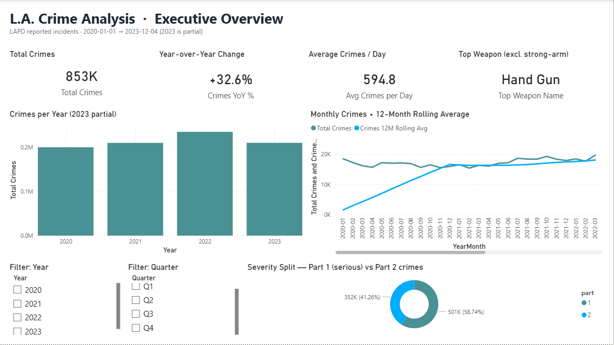
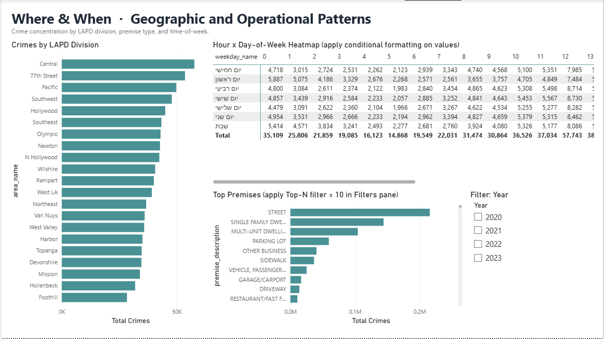
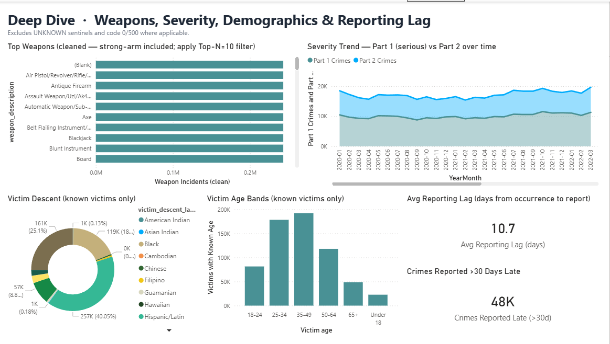
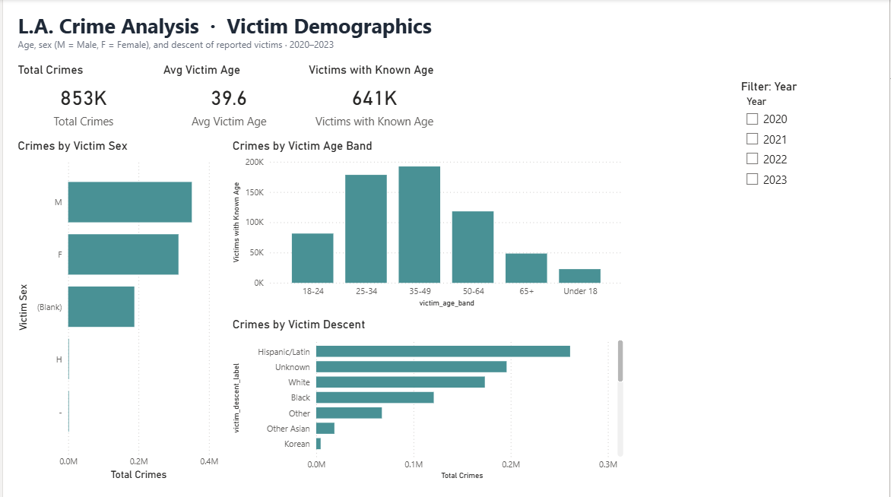
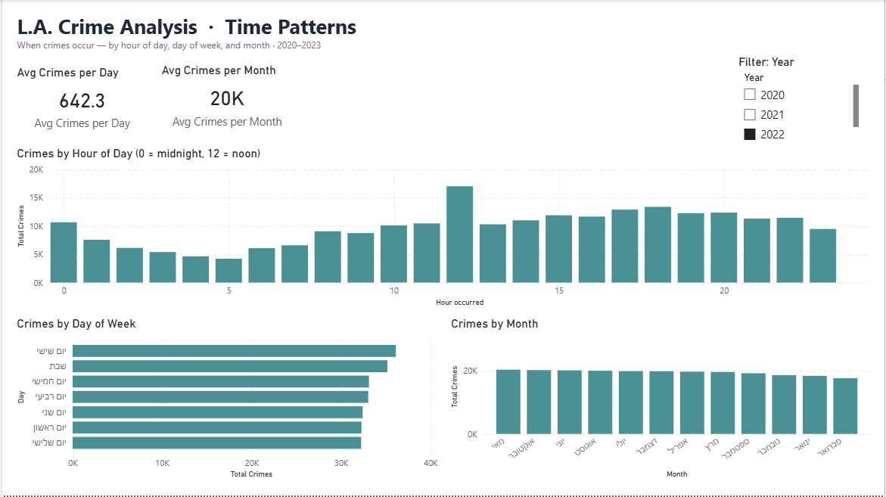
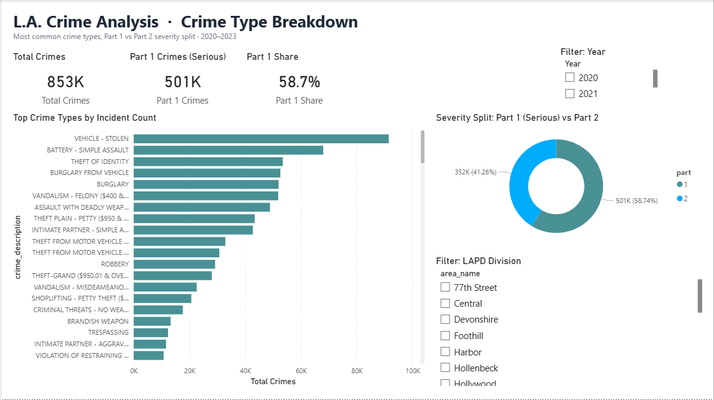
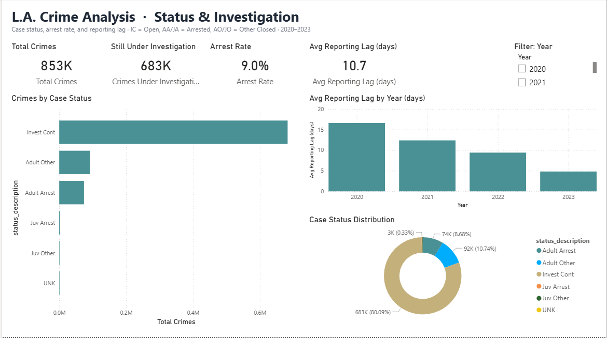

# L.A. Crime Rate - Power BI Report

This is a project I built to get my hands dirty with a genuinely messy, real-world dataset. It takes
**852,950 crime incidents reported to the LAPD** between January 2020 and early December 2023, cleans
the whole thing up, and turns it into a 7-page interactive Power BI report you can actually click
around in.

I didn't jump straight into Power BI though. Before I built a single visual I pulled the data into a
Jupyter notebook and just *looked* at it with pandas and matplotlib first - it's a lot faster to throw
a quick chart on screen and go "huh, that's weird" than it is to build a polished report and only then
notice the problem. That exploration is what told me which pages were worth building.

---

## The data

| | |
|---|---|
| **Source** | LAPD Open Data - *Crime Data from 2020 to Present* |
| **File** | `Crime_Data_from_2020_to_Present.csv` |
| **Rows** | ~852,950 reported incidents |
| **Date range** | 2020-01-01 → 2023-12-04 *(2023 is a partial year, so don't read the dip at the end as "crime went down")* |
| **Portal** | https://data.lacity.org/Public-Safety/Crime-Data-from-2020-to-Present/2nrs-mtv8 |

A quick warning if you ever use this dataset yourself: it is **not** clean. The dates come in
DD/MM/YYYY, one of the column headers was literally corrupted into the value `FOLDING KNIFE`, "unknown"
is spelled three different ways, and a bunch of columns use sentinel junk values (age `0`, sex `X`,
weapon code `0`) instead of just leaving the cell blank. Most of the work on this project was wrestling
with exactly that kind of thing.

---

## The Power BI report (7 pages)

The report has seven pages. Here are all of them, with the headline numbers straight off each page.

### 1 - Executive Overview
The "give me the headline" page. **853K total crimes, +32.6% year-over-year, 594.8 a day on average,
and "Hand Gun" as the top weapon.** The monthly-crimes line sits next to a 12-month rolling average so
the seasonal noise doesn't drown out the trend, and the donut splits the dataset into 58.7% Part 2 vs
41.3% Part 1 (serious) crimes. Year and Quarter slicers narrow everything down.



### 2 - Geographic & Operational
Where things happen. Crimes by LAPD division (Central, 77th Street and Pacific lead), the top premise
types (the **street** is #1 by a mile, then single-family and multi-unit homes), and an hour × weekday
heatmap with conditional formatting so the busy cells light up. You can already see the late-evening
columns glowing.



### 3 - Deep Dive
Weapons, severity, victim descent and - the part I'm weirdly proud of - reporting quality. The
severity area chart tracks Part 1 vs Part 2 over time, the descent donut shows victims are **40%
Hispanic/Latin**, and two cards quantify reporting quality: **average reporting lag of 10.7 days** and
**48K crimes reported more than 30 days late.**



### 4 - Victim Demographics
Who the victims are. **Average victim age 39.6, with 641K victims who have a known age.** Breakdowns
by sex (more male than female victims), the age-band column chart (that late-20s-to-40s hump from my
exploration, now filterable), and descent.



### 5 - Time Patterns
The "when" page. **642.3 crimes a day, ~20K a month.** The hour-of-day chart is the cleaned-up version
of the one from my exploration - you can still see the reporting-artifact spike at noon, but the real
story is the quiet 3-5am trough and the busy evenings. Day-of-week shows **Friday** as the worst day.



### 6 - Crime Type Breakdown
The "what" page. **501K of the 853K crimes are Part 1 (serious) - a 58.7% share.** The ranked bar
chart makes the top offenders obvious: **vehicle theft** runs away with it, followed by simple-assault
battery, identity theft and burglary from a vehicle. Sliceable by year and LAPD division.



### 7 - Status & Investigation
Case outcomes, and honestly the most sobering page. **683K crimes (about 80%) are still under
investigation, and the arrest rate is just 9.0%.** The one bit of good news: average reporting lag has
fallen every year, from ~17 days in 2020 down to ~5 in 2023.



> **Status codes:** IC = Investigation Continuing · AA = Adult Arrest · JA = Juvenile Arrest ·
> AO = Adult Other · JO = Juvenile Other

---

## The DAX measures

Everything is driven by explicit measures (full source in
[`02_DAX_Measures.dax`](02_DAX_Measures.dax)). The ones doing the heavy lifting:

| Measure | What it actually does |
|---|---|
| `Total Crimes` | `COUNTROWS` of the crime table - the backbone of nearly every visual |
| `Crimes YoY` / `Crimes YoY %` | year-over-year change using `SAMEPERIODLASTYEAR` |
| `Avg Crimes per Day` | total ÷ distinct days in the current filter context |
| `Avg Crimes per Month` | `AVERAGEX` over the YearMonth values |
| `Crimes 12M Rolling Avg` | 12-month rolling average via `DATESINPERIOD` to smooth out the noise |
| `Top Weapon Name` | most common weapon, with the "unknown" junk excluded |
| `Avg Reporting Lag (days)` | average gap between when a crime happened and when it was reported |
| `Crimes Reported Late (>30d)` | count of incidents reported more than a month late |
| `Arrest Rate` | share of crimes that ended in an adult or juvenile arrest |
| `Part 1 Crimes` / `Part 1 Share` | the serious (FBI index) crimes and their share of the total |
| `Peak Hour of Day` / `Busiest Weekday` | the single worst hour / day in the current context |

---

## The Power Query cleanup

The `crime` table goes through a multi-step M script ([`01_PowerQuery_M_Script.pq`](01_PowerQuery_M_Script.pq)).
The short version of what it has to fix:

1. Load the CSV as UTF-8.
2. Rename the corrupted `FOLDING KNIFE` header back to `weapon_description`.
3. Split `date_occurred` into a date and a time, parsed with an **en-GB** locale (it's DD/MM/YYYY).
4. Cast every column to a sane type.
5. Fix the misspelled `UNKONW` → null and proper-case the weapon text.
6. Null out the sentinel values - weapon code `0`, victim age `0`, victim sex `X`.
7. Add the derived columns the report needs: `year_occurred`, `month_name`, `quarter_occurred`,
   `weekday_name`, `weekday_number`, `hour_occurred`, `is_part_1`, `reporting_lag_days`,
   `victim_age_band`, `victim_descent_label`.
8. Drop the columns that are almost entirely null (crime codes 2-4, cross street).

---

## How to open it yourself

**1. Get the data file.** The source CSV is included here as **`data.zip`** (~42 MB compressed).
Extract it and you'll get `Crime_Data_from_2020_to_Present.csv` - drop that in the **same folder** as
`L.A_Crime_Rate.pbip`.

You can also grab it straight from the [LAPD portal](https://data.lacity.org/Public-Safety/Crime-Data-from-2020-to-Present/2nrs-mtv8),
or just run the little downloader script I included:
```
py download_data.py
```

**2. Open the report.** Install [Power BI Desktop](https://powerbi.microsoft.com/desktop/), open
`L.A_Crime_Rate.pbip`, and it'll load the model and all 7 pages.

> If you put the CSV somewhere other than the project root, update the path in Power Query Editor →
> `crime` query → `Source` step.

**3. (Optional) See the exploration.** The pandas/matplotlib notebook I used to first poke at the data
lives over in `../../All course files/Python Section/LA Crime Project.ipynb`.

---

## What's in the folder

```
L.A Crime Rate/
├── L.A_Crime_Rate.pbip                   # open this
├── data.zip                              # the source CSV, zipped
├── 01_PowerQuery_M_Script.pq             # the full cleanup script (reference)
├── 02_DAX_Measures.dax                   # every measure (reference)
├── validate_dataset.py                   # sanity-checks the raw data
├── validate_pbir.py                      # sanity-checks the report structure
├── images/                               # the 7 report page screenshots
├── L.A_Crime_Rate.Report/                # the report definition (PBIR)
└── L.A_Crime_Rate.SemanticModel/         # the data model (TMDL)
```

---

*Built with Power BI Desktop + a pandas/matplotlib notebook for the exploration. Data is public LAPD
open data - every incident here is a real reported crime, so treat the demographic charts with the
seriousness they deserve.*
